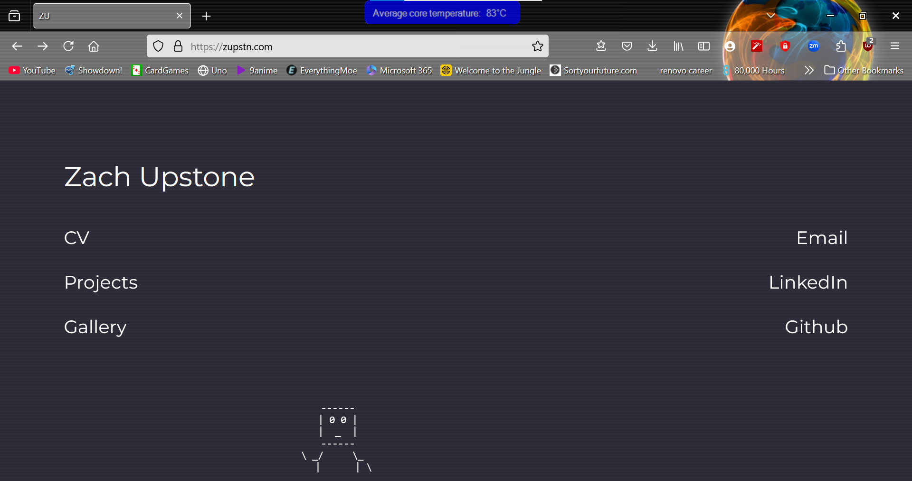

# 🌡️ Temperature Glass

Add a C# overlay form that shows the current average tempreature of the computer's cores.

<u>**This is built for Windows**</u>

## Setup

The program is built for x64 Windows machine and can be started by running : 

`.\TempGlass\bin\Debug\net48\win-x64\TempGlass.exe`

<u>**with Administrator priviledges**</u> (needed to access core tempreature).

Crucially it relies on `OpenHardwareMonitorLib.dll` so the .exe may not work if moved on it own outside of this folder.

It is most easily exited by use of task manager `ctrl + shift + esc` and locating `TempGlass.exe` and force closing.

## Setting up to run on login (Windows 10)

1)  Press Win + R, type `taskschd.msc`, and press enter, Task Scheduler will open.
2)  In Task Scheduler click Create Basic Task.
3)  Enter a name and click Next.
4)  Select "When I log on" and click Next.
5)  Select "Start a program" and click Next.
6)  Click Browse, select `.\TempGlass\bin\Debug\net48\win-x64\TempGlass.exe`, and click Next.
7)  Tick "open the Properties dialog..." and then click Finish.
8)  Within the Properties dialog, check "Run with highest privileges".

Next time you log in, TempGlass will automatically start up.